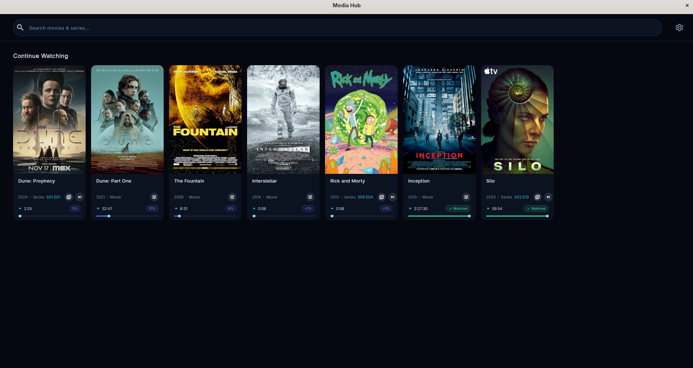
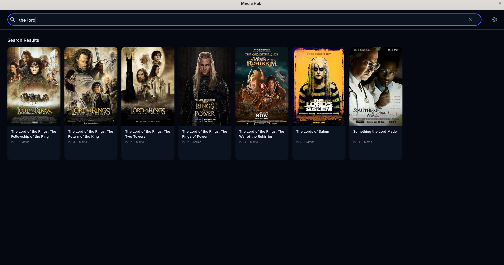
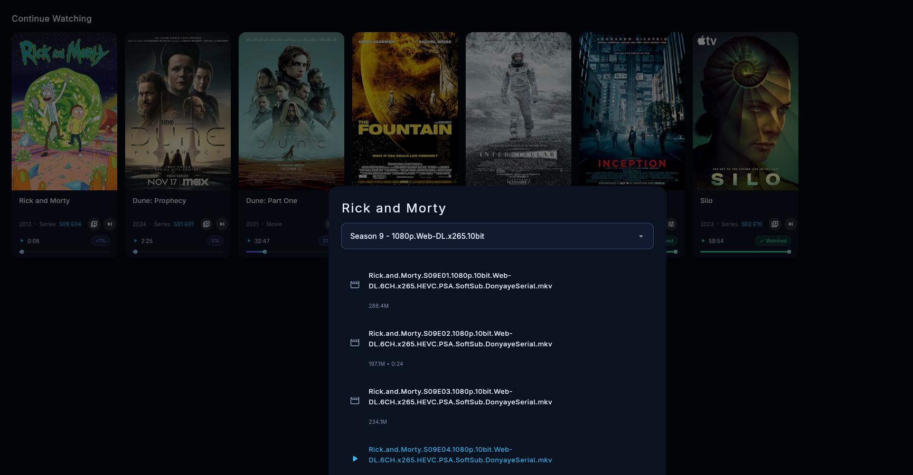

# 🎬 Media Hub

A modern desktop media hub for browsing and watching movies & series.  
Media Hub lets you search titles, view continue-watching history, choose quality or season, and play media with mpv.

> This project is only a player/catalog client and does not host any media files.

---

## ✨ Features

- 🎞️ Browse movies and series
- 🔍 Search by English and Persian titles
- 🕘 Continue Watching with playback progress
- ▶️ Resume playback from last position
- 🧭 Season and quality selection
- ⏭️ Next episode support for series
- 🖼️ Automatic poster fetching via OMDb API
- 🌙 Modern dark UI

---

## 📸 Screenshots

| Home | Search | Details |
|---|---|---|
|  |  |  |

---

## 🧰 Requirements

- Python 3.10+
- [mpv](https://mpv.io/) installed and available in your system `PATH`
- Internet connection
- Optional: OMDb API key for posters

---

## 🚀 Installation

Clone the repository:

```bash
git clone https://github.com/mostafaasadi/mediahub.git
cd mediahub
```

Create and activate a virtual environment:

```bash
python -m venv .venv
```

Windows:

```bash
.venv\Scripts\activate
```

Linux / macOS:

```bash
source .venv/bin/activate
```

Install dependencies:

```bash
pip install -r requirements.txt
```

---

## ▶️ Run

```bash
python main.py
```
---

## ⚡ Quick Launch (Shell Alias)

If you use this app frequently, you can add a shell alias to launch it with a single short command from anywhere.

### Linux / macOS

Add this line to your `~/.bashrc`, `~/.zshrc`, or `~/.profile`:

```bash
alias mediahub="cd /path/to/mediahub && source .venv/bin/activate && python main.py"
```

Replace `/path/to/mediahub` with the actual path where you cloned the repository. For example:

```bash
alias mediahub="cd ~/projects/mediahub && source .venv/bin/activate && python main.py"
```

Then reload your shell config:

```bash
source ~/.bashrc
```

Now you can simply type:

```bash
mediahub
```

### Windows (PowerShell)

Open your PowerShell profile:

```powershell
notepad $PROFILE
```

Add this function:

```powershell
function mediahub {
    Set-Location "C:\path\to\mediahub"
    & ".venv\Scripts\Activate.ps1"
    python main.py
}
```

Replace the path with your actual project location, save the file, and restart PowerShell. Then just run:

```powershell
mediahub
```

### Windows (Batch File)

Alternatively, create a file called `mediahub.bat` anywhere in your `PATH`:

```bat
@echo off
cd /d C:\path\to\mediahub
call .venv\Scripts\activate.bat
python main.py
```
---

## ⚙️ Configuration

Open **Settings** from the top-right corner inside the app.

### Catalog Source URL

Set the catalog URL that provides your media list.

Example:

```text
https://example.com/path/to/catalog.js
```

Then click **Save & Sync**.

### OMDb API Key

For movie and series posters:

1. Go to [https://www.omdbapi.com/apikey.aspx](https://www.omdbapi.com/apikey.aspx)
2. Get a free API key
3. Enter it in **Settings → OMDB API Key**
4. Save settings

---

## 🙏 Acknowledgments

### Catalog Source

This project uses media catalog data from **DonyayeSerial (دنیای سریال)**.

Special thanks to the DonyayeSerial team for providing and maintaining the comprehensive movie and series catalog that powers this application.

Their work in organizing and categorizing Persian and international media content has made this project possible.

---

## 🤖 AI-Assisted Development

This entire project was developed through an interactive **question-and-answer** process with artificial intelligence.  
Every part of the codebase — including the UI components, backend logic, database management, playback integration, and even this README — was written through conversational prompts and step-by-step instructions with the help of the **Qwen** AI model.

No traditional manual coding was performed. This project serves as a practical example of how a full-featured desktop application can be built through **AI-guided development**.

---

## ⚖️ Legal Disclaimer

This project is provided only as a media player and catalog client.

- This project does **not** host, upload, store, or distribute any media content.
- This project does **not** include any built-in copyrighted movies or series.
- Any catalog source, media links, or metadata used by the user are provided by external third-party sources.
- Users are solely responsible for ensuring that their use of this software complies with applicable laws in their jurisdiction.
- The developer is not responsible for any misuse, copyright infringement, or unauthorized use of content.

Use this project only for lawful and personal purposes.

---

<div align="center">

**Built with 💻 Python + 🤖 AI (Qwen)**

</div>